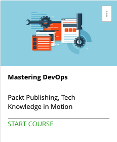

```
Roberto Nogueira  
BSd EE, MSd CE
Solution Integrator Experienced - Certified by Ericsson
```
# Udemy Mastering DevOps



**About **

Learn everything you need to about the subject of this `Udemy` project.

[Homepage](https://www.udemy.com/mastering-devops/)

## Topics
```
Section: 1
0 / 6
What is DevOps?
[x] 1. The Course Overview 7:07
[x] 2. Is DevOps for Me? 7:32
[x] 3. The First Way – Systems Thinking 8:54
[x] 4. The Second Way – Feedback Loops 8:37
[x] 5. The Third Way – Culture of Experimentation 8:51
[x] 6. The Principle of Kaizen 5:56

Section: 2
0 / 4
The CAMS model – DevOps Thinking
[x] 7. CAMS – Culture 8:26
[x] 8. CAMS – Automation 6:14
[x] 9. CAMS – Measurement 5:26
[x] 10. CAMS – Sharing 8:12

Section: 3
0 / 5
Establishing a DevOps Culture
[x] 11. Traditional Versus DevOps SDLC 8:23
[x] 12. Service Ownership 8:43
[x] 13. Hack Events 12:04
[x] 14. Destructive Testing 5:15
[x] 15. Cross-Functional Teams 5:20

Section: 4
0 / 5
Automation – Configuration Management
[x] 16. Why Automate? 9:25
[x] 17. Configuration Management with SaltStack 11:09
[x] 18. Configuration Management for Distributed Systems 7:19
[x] 19. What about Containers? 7:51
[x] 20. Building and Running a Docker Container 8:19

Section: 5
0 / 5
Automation – Continuous Delivery
[x] 21. What is Continuous Delivery? 9:58
[x] 22. Your First Test Environment 10:35
[ ] 23. Configuring and Launching with Vagrant 12:47
[ ] 24. Testing with Serverspec 9:26
[ ] 25. Am I Ready for Production? 5:43

Section: 6
0 / 5
Measurement
[ ] 26. Measurement Concepts 10:53
[ ] 27. A Tour of Graphite 12:11
[ ] 28. Getting Your Data into Graphite 13:59
[ ] 29. Monitoring Agent Examples 8:47
[ ] 30. Actionable Data 14:41

Section: 7
0 / 4
Sharing
[ ] 31. Agile 13:49
[ ] 32. Learning Reviews 11:32
[ ] 33. Chatbots 10:08
[ ] 34. Other Sharing Tools 10:44

Section: 8
0 / 4
Where Do I Go From Here?
[ ] 35. Security/Quality Engineering 9:26
[ ] 36. Compliance 10:17
[ ] 37. Sales, Marketing, and Beyond 4:41
[ ] 38. Becoming a Learning Organization 8:49
```
